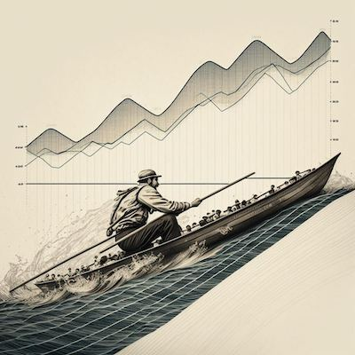

.. Open edX OARS documentation master file, created by
   sphinx-quickstart on Thu Jan  5 14:35:06 2023.
   You can adapt this file completely to your liking, but it should at least
   contain the root `toctree` directive.

Welcome to Open edX OARS's documentation!
=========================================

rs, proving the ultimate futility of trying to achieve perfection visualization from large sets of messy data. :)

.. toctree::
   :maxdepth: 2
   :caption: Contents:

   Concepts <concepts/index>
   Decisions <decisions/index>
   How-Tos <how-tos/index>
   Quickstarts <quickstarts/index>
   Reference <reference/index>

Indices and tables
==================

* :ref:`genindex`
* :ref:`modindex`
* :ref:`search`
